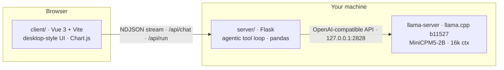

# Tabitha

**Your own local spreadsheet agent — powered by your own local LLM.**

Tabitha is a local AI assistant that lets you talk to your spreadsheets. Upload a gradebook, an attendance sheet, or a test record, and just ask: *"Who has the best average?"*, *"How many students were absent more than 10 days?"*, *"Chart the grades per section."* Tabitha reads the actual data, computes real answers, and replies with tables and charts — no formulas to remember, no menus to dig through.


## Why local?

We believe AI belongs in everyone's hands — not behind a subscription, an API key, or an internet connection. This technology should make people's lives easier, and it can't do that if your data has to leave your device to use it.

Tabitha runs a real LLM — [MiniCPM5-2B](https://huggingface.co/openbmb/MiniCPM5-2B) — on your own hardware via llama.cpp:

- **Private by design.** Your workbook never leaves the device. Grades, attendance, names — nothing is sent to a cloud API.
- **Works offline.** After the one-time model download, no network is needed at all.
- **Free forever.** No tokens, no usage caps, no accounts.
- **Yours.** The whole stack — model, server, UI — runs where you can see it and control it.

Small models have gotten good enough to be genuinely useful. Tabitha is our proof: a 2B-parameter model on a laptop, acting as an agent over your files, is already a better experience than wrestling a spreadsheet UI.

## Quick start

Requirements: **Python 3.10+**, **Node.js 20+**, **curl**. Linux x86_64 and macOS (arm64/x86_64).

```bash
./start.sh
```

That's it. On first run it downloads the model (~1.5 GB, sha256-verified) from this repo's GitHub Releases, installs dependencies, builds the UI, starts `llama-server` on `127.0.0.1:2828`, and serves the app at **http://localhost:2424**. Later runs skip everything that's already done.

Try it with a sample: `client/public/samples/bicol_university_grades.xlsx` — drag it onto the chat window and ask a question.

> **Prefer a bigger model on another machine?** Point Tabitha at any OpenAI-compatible server and skip the local model entirely:
> ```bash
> LLM_BASE_URL=http://192.168.0.159:2828/v1 ./start.sh
> ```

---

# Documentation

## Architecture



- **`server/`** — Flask API. Parses `.xlsx`/`.csv` into pandas DataFrames, builds the system prompt from the actual columns, and runs the LLM tool-calling loop. Streams progress to the client as NDJSON events.
- **`client/`** — Vue 3 single-page app styled like a desktop OS: top bar, draggable windows, dock. Files render locally in a spreadsheet viewer *and* upload to the backend so Tabitha can query them.
- **`vendor/llama/`** — bundled `llama-server` binaries (not committed; `start.sh` fetches the official release if absent).
- **`models/`** — the GGUF weights (not committed; downloaded from GitHub Releases by `start.sh`).

## The model

| | |
|---|---|
| **Model** | [MiniCPM5-2B](https://huggingface.co/openbmb/MiniCPM5-2B) (OpenBMB) |
| **File** | `MiniCPM5-2B-Q4_K_M.gguf` — ~1.5 GB, Q4_K_M quantization |
| **Runtime** | llama.cpp `llama-server` (build b11527), vendored for offline dev |
| **Context** | 16,384 tokens, single slot (`-c 16384 -np 1`) |
| **Reasoning** | Native thinking mode; exposed as the **Deep Think** toggle, capped by `THINK_BUDGET` |
| **Source** | This repo's [GitHub Releases](https://github.com/shuhailycasan/tabitha/releases/tag/Model); sha256 pinned in `start.sh` |

A 2B model is small, so the server does a lot of quiet correction on its behalf: lenient argument coercion (`"5"` → `5`, `"false"` → `false`), loop detection when it repeats an identical call, one retry on empty replies, and `Steer` errors that are sent back to the model but hidden from the user.

## Agentic capabilities

Tabitha isn't a one-shot prompt — the backend runs an agent loop (`server/chat.py`):

- **Tool calling.** The model calls spreadsheet tools (below), sees the real results, and answers — up to 8 tool rounds per question.
- **Streaming transcript.** Every step is an NDJSON event (`status`, `ctx`, `compact`, `think`, `tool`, `delta`, `chart`, `done`, `error`), so the UI shows reasoning, tool chips, and text as they happen.
- **Deep Think.** Optional chain-of-thought (`enable_thinking` + `reasoning_budget`), shown in a collapsible box. Off by default — roughly 4× faster.
- **Multi-file scope.** Attach several files or `@mention` them per message; the backend merges sheets on a shared first column into one dataset.
- **Auto-compaction.** When the prompt would exceed 60% of the context window, the oldest turns are dropped and the user is told.
- **Interruption.** Stop button or Enter-twice cancels mid-stream (`/api/cancel/<req_id>`), keeping whatever already streamed.
- **Per-turn timer.** Each reply shows live elapsed time while it generates and the total once done.

## Tools

The model's toolset, defined in `server/tools/specs.py` and dispatched in `server/tools/dispatch.py`. The same tools back the `/commands` (called directly via `POST /api/run`, no LLM involved).

| Tool | Args (required **bold**) | What it does |
|---|---|---|
| `summarize` | **sheet**, column | Class-wide stats per numeric column: mean, min, max, and *who* holds them |
| `top_rows` | **sheet**, **column**, n, ascending | Rank rows by a column, top or bottom N |
| `filter_rows` | **sheet**, **column**, **op**, **value**, limit | Rows matching a condition (`= != > < >= <= contains`) + match count |
| `row_stats` | **sheet**, columns, op, ascending, limit | Per-row avg/sum/min/max across columns, ranked — e.g. each student's overall average |
| `list_rows` | **sheet**, columns, sort_by, ascending, limit | Sheet contents as a markdown table, optionally subset and sorted |
| `group_stats` | **sheet**, **by**, columns, op, ascending | Totals/averages per group — e.g. which section has the most absences |
| `bar_chart` | sheet, column, by, op, n, ascending — or custom labels + values | Renders a Chart.js bar chart from sheet data or from numbers the model computed itself |
| `list_sheets` | — | Sheets in the loaded file(s) with row counts and column names |
| `lookup` | **name** | Everything about one person/item: matching rows across *every* sheet |
| `compute` | **expression** | Safe arithmetic (`+ - * / **`, `avg sum min max abs round`) when no other tool fits |

## Chat commands & mentions

Instant shortcuts — they call the tools directly without waiting on the LLM. Tab-completes real sheet and column names.

| Command | Does |
|---|---|
| `/list [sheet] [n]` | Rows as a table (→ `list_rows`) |
| `/stats [sheet] [column]` | Stats for a column or the whole sheet (→ `summarize`) |
| `/top <column> [n]` | Highest rows (→ `top_rows`) |
| `/bottom <column> [n]` | Lowest rows (→ `top_rows` ascending) |
| `/chart <column> [n]` | Bar chart (→ `bar_chart`) |
| `/lookup <name>` | Find a name in every sheet (→ `lookup`) |
| `/deepthink` · `/fast` | Toggle reasoning mode |
| `/clear` · `/help` | Reset the chat / show commands |
| `@file` | Include another uploaded file in the question's scope |

## HTTP API

| Endpoint | Purpose |
|---|---|
| `GET /` | Serves the built client (`client/dist`) |
| `GET /api/health` | `{ ok, model, ctx }` |
| `POST /api/upload` | Multipart `.xlsx`/`.csv` upload → dataset id, sheet info (25 MB max) |
| `GET /api/datasets` | List uploaded datasets |
| `DELETE /api/datasets/<id>` | Remove a dataset and its file |
| `POST /api/chat` | `{ messages, dataset_ids, think, request_id }` → NDJSON event stream |
| `POST /api/run` | Direct tool call for `/commands`: `{ dataset_ids, tool, args }` |
| `POST /api/cancel/<req_id>` | Stop a chat stream between tool rounds |

## Configuration

Environment variables read by `server/app.py` and `start.sh`:

| Variable | Default | Purpose |
|---|---|---|
| `LLM_BASE_URL` | `http://127.0.0.1:2828/v1` | Any OpenAI-compatible endpoint; set it to skip the local model |
| `LLM_MODEL` | `models/MiniCPM5-2B-Q4_K_M.gguf` | Model alias sent to the server |
| `CTX_TOKENS` | `16384` | Context window — must match llama-server's `-c` / `-np` |
| `THINK_BUDGET` | `500` | llama.cpp `reasoning_budget` for Deep Think |
| `THINK_MAX_CHARS` | `1500` | Cap on reasoning text shown in the UI |
| `PORT` | `2424` | Flask app port |
| `LLAMA_PORT` | `2828` | llama-server port (start.sh only) |
| `REBUILD_CLIENT` | `0` | `1` forces `npm run build` on start |

## Frontend

Vue 3 + Vite app in `client/`, styled like a Linux desktop:

- `src/component/` — Vue SFCs: `TopBar`, `OsWindow` (shared window chrome), `SpreadsheetWindow`, `ChatWindow`, `Dock`, `Toast`, `MessageChart`
- `src/feature/<name>/engine.js` — one engine per feature (`windows`, `chat`, `datasets`, `spreadsheet`, `desktop`, `files`); plain JS + reactive state, no DOM, easy to debug in isolation
- `src/feature/excel-viewer-engine/` — standalone zero-dependency view-only spreadsheet reader (`.xlsx` via `DecompressionStream` + `DOMParser`, plus CSV/TSV); usable outside Vue
- `src/assets/` — Tabitha mascot sprites; `public/favicon.png`, `public/samples/*.xlsx`

Hot-reload development:

```bash
python server/app.py        # API on :2424
cd client && npm run dev    # UI on :7777 — /api proxied to Flask
```

For production, `npm run build` emits `client/dist/`, which Flask serves at :2424. Rebuild after editing the frontend before running the Flask-only setup.

## Files

- `server/app.py` — Flask API, upload/dataset management, chat endpoint
- `server/chat.py` — the agentic LLM loop and NDJSON streaming
- `server/tools/` — tool specs, dispatch, pandas helpers, charts, safe calculator
- `server/prompts.py`, `server/state.py`, `server/config.py` — system prompt, dataset store, env config
- `tests/` — pytest suite for the tools layer + upload/run endpoints
- `scripts/make_samples.py` — regenerates the sample workbooks

```bash
.venv/bin/python -m pytest tests/   # no LLM needed
```

### Publishing the model asset (maintainers)

The model is too big for git — it lives as a release asset. One-time setup:

```bash
gh release create Model --title "Model" --notes "Tabitha" \
  /path/to/MiniCPM5-2B-Q4_K_M.gguf
```

or via the web UI: Releases → Draft a new release → tag `Model` → attach `MiniCPM5-2B-Q4_K_M.gguf`. The tag must match `RELEASE_TAG` in `start.sh`.
