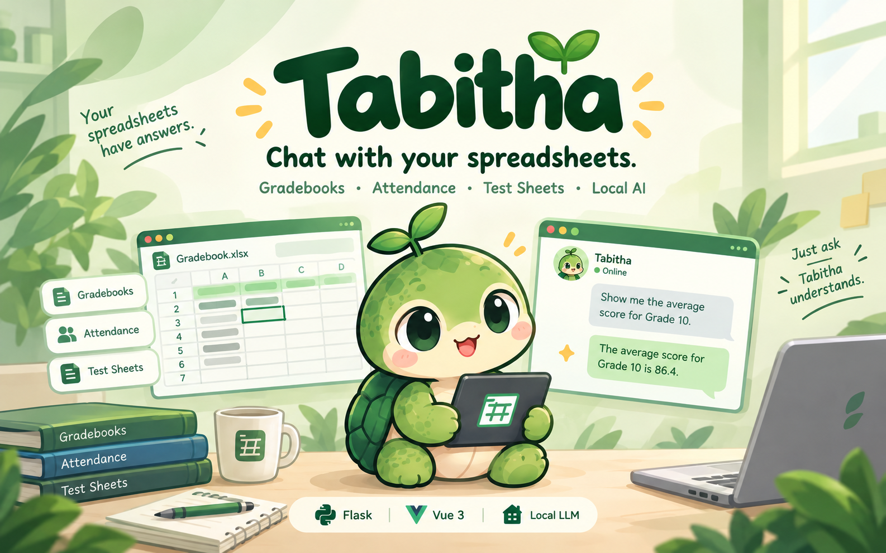

# Tabitha

Chat with your Excel gradebooks, attendance and test sheets in plain English, powered by a local LLM — [MiniCPM5-2B](https://huggingface.co/openbmb/MiniCPM5-2B) (Q4_K_M GGUF) running on llama.cpp.

Flask backend (`server/app.py`) + a Vue 3 / Vite frontend (`client/`). The LLM calls tools on the uploaded spreadsheet, so answers come from the actual data.

## Run (one click)

Requirements: Python 3.10+, Node.js 20+, curl. Linux x86_64 and macOS (arm64/x86_64).

```bash
./start.sh
```

First run downloads the model (~1.5 GB) from the repo's GitHub Releases into `models/` (verified by sha256), installs deps, builds the client, starts `llama-server` on `127.0.0.1:2828`, then serves the app at http://localhost:2424. Later runs skip everything that's already done. Upload a `.xlsx` (try `client/public/samples/bicol_university_grades.xlsx`) and start asking questions.

`llama-server` (llama.cpp b11527) is vendored under `vendor/llama/` for offline dev; if it's not there (e.g. `vendor/` is gitignored on a fresh clone), `start.sh` downloads the official binary for your platform automatically.

To use a different LLM server instead of the local model (skips the download):

```bash
LLM_BASE_URL=http://192.168.0.159:2828/v1 ./start.sh
```

### Publishing the model asset (maintainers)

The model is too big for git — it lives as a release asset. One-time setup:

```bash
# GitHub CLI
gh release create Model --title "Model" --notes "Tabitha" \
  /path/to/MiniCPM5-2B-Q4_K_M.gguf
```

or via the web UI: Releases → Draft a new release → tag `Model` → attach `MiniCPM5-2B-Q4_K_M.gguf`. The tag must match `RELEASE_TAG` in `start.sh`.

## Vue.js frontend

The frontend is a Vue 3 + Vite app in `client/` styled like a Linux desktop: a top bar, draggable floating windows, and a dock. Structure:

- `src/component/` — Vue SFCs: `TopBar`, `OsWindow` (shared window chrome), `SpreadsheetWindow`, `ChatWindow`, `Dock`, `Toast`
- `src/feature/<name>/engine.js` — one engine per feature (`windows`, `chat`, `datasets`, `spreadsheet`, `desktop`, `files`); plain JS + reactive state, no DOM, easy to debug in isolation
- `src/feature/excel-viewer-engine/` — standalone zero-dependency view-only spreadsheet reader (`.xlsx` via `DecompressionStream` + `DOMParser`, plus CSV/TSV); usable outside Vue
- `src/assets/` — Tabitha mascot sprites; `public/favicon.png`

Opening a file renders it locally via excel-viewer-engine and also uploads it to the backend so Tabitha can answer questions about it.

For UI development with hot reload, run both servers:

```bash
python server/app.py        # API on :2424
cd client && npm run dev    # UI on :7777 — /api requests are proxied to Flask
```

For production, `npm run build` emits `client/dist/`, which Flask serves at http://localhost:2424. Rebuild after editing the frontend before running the Flask-only setup.

## LLM server

`start.sh` runs the vendored `llama-server` (llama.cpp b11527) on `127.0.0.1:2828` with [MiniCPM5-2B](https://huggingface.co/openbmb/MiniCPM5-2B) (`MiniCPM5-2B-Q4_K_M.gguf`, ~1.5 GB). To point at a different server or model, use env vars — `server/app.py` reads:

```python
LLM_BASE_URL = os.environ.get("LLM_BASE_URL", "http://127.0.0.1:2828/v1")
LLM_MODEL = os.environ.get("LLM_MODEL", "models/MiniCPM5-2B-Q4_K_M.gguf")
```

## Files

- `server/app.py`: Flask API, LLM tool-calling loop, spreadsheet tools
- `tests/`: pytest suite for the tools layer + upload/run endpoints — `.venv/bin/python -m pytest tests/` (no LLM needed)
- `client/`: Vue 3 + Vite frontend (`npm run dev` / `npm run build` → `client/dist/`)
- `client/public/samples/*.xlsx`: example spreadsheets — Bicol University + Divine Word College (regenerate with `scripts/make_samples.py`)
