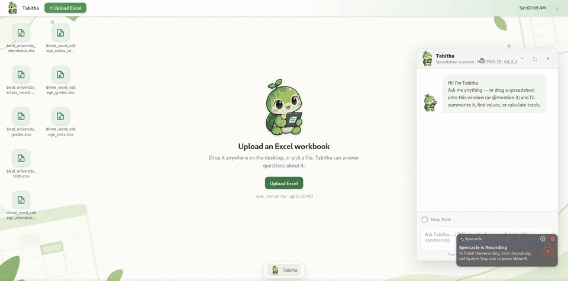
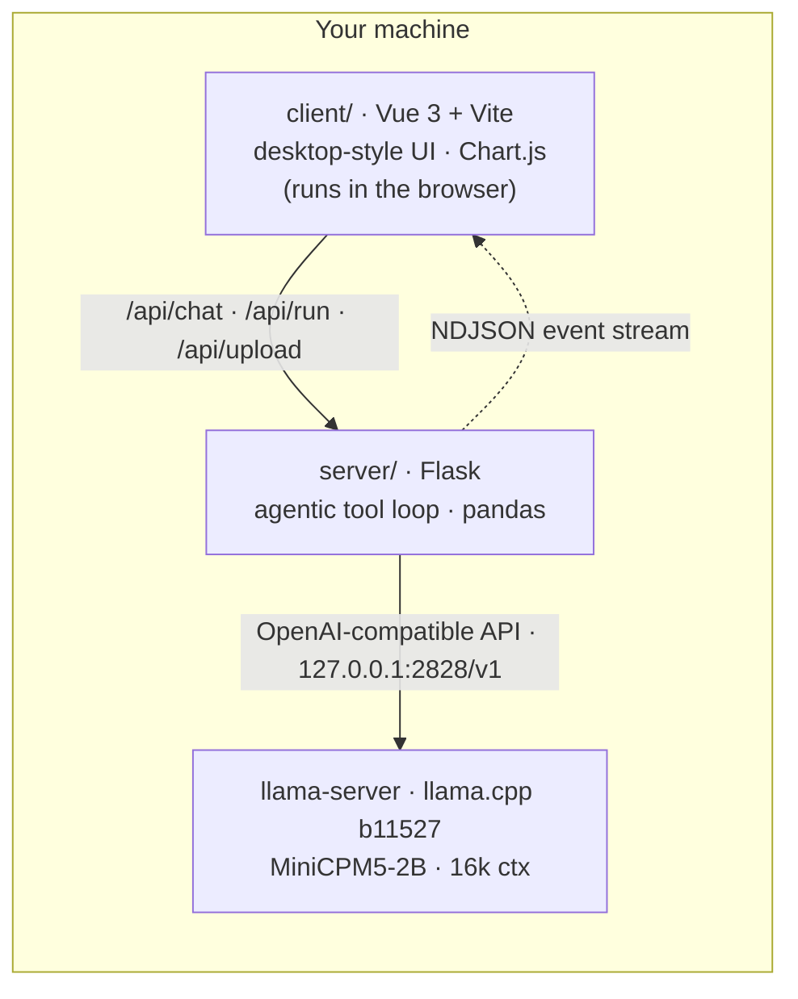
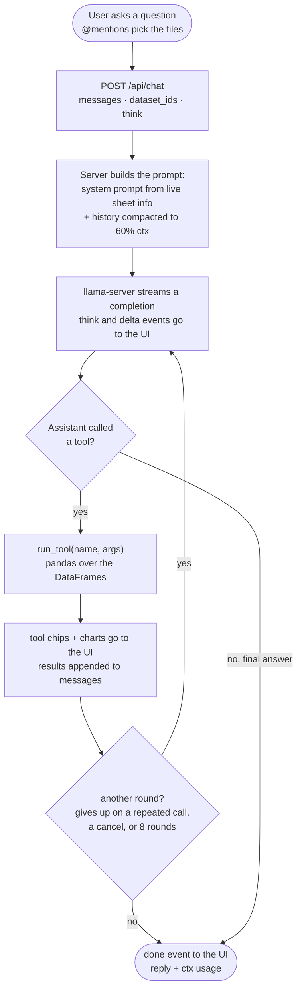

# Tabitha

**Your own local spreadsheet agent, powered by your own local LLM.**

Tabitha is a local AI assistant that lets you talk to your spreadsheets. Upload a gradebook, an attendance sheet, or a test record, and just ask: *"Who has the best average?"*, *"How many students were absent more than 10 days?"*, *"Chart the grades per section."* Tabitha reads the actual data, computes real answers, and replies with tables and charts. You do not need to remember formulas or dig through menus.



## Why local?

We believe AI belongs in everyone's hands, not behind a subscription, an API key, or an internet connection. This technology should make people's lives easier, and it cannot do that if your data has to leave your device to use it.

Tabitha runs a real LLM, [MiniCPM5-2B](https://huggingface.co/openbmb/MiniCPM5-2B), on your own hardware through llama.cpp. This gives you:

- **Privacy by design.** Your workbook never leaves the device. Grades, attendance, and names are never sent to a cloud API.
- **Offline use.** After the one-time model download, no network is needed at all.
- **Zero cost.** There are no tokens, usage caps, or accounts.
- **Full control.** The whole stack (model, server, and UI) runs where you can see it and control it.

Small models have gotten good enough to be genuinely useful. Tabitha is our proof: a 2B-parameter model on a laptop, acting as an agent over your files, is already a better experience than wrestling a spreadsheet UI.

## Quick start

You need Python 3.10+, Node.js 20+, and curl. Linux x86_64 and macOS (arm64/x86_64) are supported.

```bash
./start.sh
```

That is it. On first run it downloads the model (~1.5 GB, sha256-verified) from this repo's GitHub Releases, installs dependencies, builds the UI, starts `llama-server` on `127.0.0.1:2828`, and serves the app at **http://localhost:2424**.

Try it with the sample file `client/public/samples/bicol_university_grades.xlsx`. Drag it onto the chat window and ask a question.

> **Prefer a bigger model on another machine?** Point Tabitha at any OpenAI-compatible server and skip the local model entirely:
> ```bash
> LLM_BASE_URL=http://192.168.0.159:2828/v1 ./start.sh
> ```

---

# Documentation

## Architecture



- **`server/`** is the Flask API. It parses `.xlsx` and `.csv` files into pandas DataFrames, builds the system prompt from the actual columns, and runs the LLM tool-calling loop. It streams progress to the client as NDJSON events.
- **`client/`** is a Vue 3 single-page app styled like a desktop OS, with a top bar, draggable windows, and a dock. Files render locally in a spreadsheet viewer and also upload to the backend so Tabitha can query them.
- **`vendor/llama/`** holds the bundled `llama-server` binaries. It is not committed to git. If it is missing, `start.sh` fetches the official llama.cpp release.
- **`models/`** holds the GGUF weights. It is not committed to git. `start.sh` downloads it from GitHub Releases.

## The model

| | |
|---|---|
| **Model** | MiniCPM5-2B, 2B parameters |
| **Creator** | [OpenBMB](https://huggingface.co/openbmb). Original model: [huggingface.co/openbmb/MiniCPM5-2B](https://huggingface.co/openbmb/MiniCPM5-2B) |
| **File** | `MiniCPM5-2B-Q4_K_M.gguf`, about 1.5 GB, Q4_K_M quantization |
| **Runtime** | llama.cpp `llama-server` (build b11527), vendored for offline dev |
| **Context** | 16,384 tokens, single slot (`-c 16384 -np 1`) |
| **Reasoning** | Native thinking mode, exposed as the **Deep Think** toggle and capped by `THINK_BUDGET` |
| **Download** | This repo's [GitHub Releases](https://github.com/shuhailycasan/tabitha/releases/tag/Model) mirror. The sha256 is pinned in `start.sh`. |

A 2B model is small, so the server does a lot of quiet correction on its behalf: lenient argument coercion (`"5"` to `5`, `"false"` to `false`), loop detection when it repeats an identical call, one retry on empty replies, and `Steer` errors that are sent back to the model but hidden from the user.

## Agentic capabilities

Tabitha is not a one-shot prompt. The backend runs an agent loop (`server/chat.py`):

- **Tool calling.** The model calls spreadsheet tools (listed below), reads the real results, and answers. It can use up to 8 tool rounds per question.
- **Streaming transcript.** Every step is an NDJSON event (`status`, `ctx`, `compact`, `think`, `tool`, `delta`, `chart`, `done`, `error`), so the UI shows reasoning, tool chips, and text as they happen.
- **Deep Think.** This is an optional chain-of-thought mode (`enable_thinking` + `reasoning_budget`), shown in a collapsible box. It is off by default, which keeps replies roughly 4× faster.
- **Multi-file scope.** You can attach several files or `@mention` them per message. Their sheets are pooled into one virtual dataset, and the magic sheet `"all"` outer-merges every sheet that shares a first column.
- **Auto-compaction.** When the prompt would exceed 60% of the context window, the oldest turns are dropped and the UI says so.
- **Interruption.** The Stop button, or pressing Enter twice, cancels mid-stream (`/api/cancel/<req_id>`) and keeps whatever already streamed.
- **Per-turn timer.** Each reply shows live elapsed time while it generates and the total once done.

### The agentic loop

This is the full path of one question, from the user to the server and back:



Identical repeated calls are steered back once ("you already have this result"), then the loop gives up gracefully. This is a known failure mode of small models. `Steer` errors reach the model but never appear in the user's tool chips.

## Tools

These are the tools the model can call. They are defined in `server/tools/specs.py` and dispatched in `server/tools/dispatch.py`. The same tools power the `/commands`, which call them directly through `POST /api/run` without the LLM.

| Tool | Args (required **bold**) | What it does |
|---|---|---|
| `summarize` | **sheet**, column | Class-wide stats per numeric column: mean, min, max, and *who* holds them |
| `top_rows` | **sheet**, **column**, n, ascending | Rank rows by a column, top or bottom N |
| `filter_rows` | **sheet**, **column**, **op**, **value**, limit | Rows matching a condition (`= != > < >= <= contains`) plus the match count |
| `row_stats` | **sheet**, columns, op, ascending, limit | Per-row avg/sum/min/max across columns, ranked. Example: each student's overall average |
| `list_rows` | **sheet**, columns, sort_by, ascending, limit | Sheet contents as a markdown table, optionally subset and sorted |
| `group_stats` | **sheet**, **by**, columns, op, ascending | Totals or averages per group. Example: which section has the most absences |
| `bar_chart` | sheet, column, by, op, n, ascending; or custom labels + values | A Chart.js bar chart from sheet data, or from numbers the model computed itself |
| `list_sheets` | (none) | Sheets in the loaded file(s) with row counts and column names |
| `lookup` | **name** | Everything about one person or item: matching rows across *every* sheet |
| `compute` | **expression** | Safe arithmetic (`+ - * / **`, `avg sum min max abs round`) when no other tool fits |

## Chat commands & mentions

These are instant shortcuts. They call the tools directly without waiting on the LLM, and they autocomplete real sheet and column names as you type.

| Command | Does |
|---|---|
| `/list [sheet] [n]` | Rows as a table (calls `list_rows`) |
| `/stats [sheet] [column]` | Stats for a column or the whole sheet (calls `summarize`) |
| `/top <column> [n]` | Highest rows (calls `top_rows`) |
| `/bottom <column> [n]` | Lowest rows (calls `top_rows` ascending) |
| `/chart <column> [n]` | Bar chart (calls `bar_chart`) |
| `/lookup <name>` | Find a name in every sheet (calls `lookup`) |
| `/deepthink` · `/fast` | Toggle reasoning mode |
| `/clear` · `/help` | Reset the chat / show commands |
| `@file` | Include another uploaded file in the question's scope |

## HTTP API

| Endpoint | Purpose |
|---|---|
| `GET /` | Serves the built client (`client/dist`) |
| `GET /api/health` | Returns `{ ok, model, ctx }` |
| `POST /api/upload` | Multipart `.xlsx`/`.csv` upload, returns dataset id and sheet info (25 MB max) |
| `GET /api/datasets` | Lists uploaded datasets |
| `DELETE /api/datasets/<id>` | Removes a dataset and its file |
| `POST /api/chat` | `{ messages, dataset_ids, think, request_id }`, returns an NDJSON event stream |
| `POST /api/run` | Direct tool call for `/commands`: `{ dataset_ids, tool, args }` |
| `POST /api/cancel/<req_id>` | Stops a chat stream between tool rounds |

## Configuration

Environment variables read by `server/app.py` and `start.sh`:

| Variable | Default | Purpose |
|---|---|---|
| `LLM_BASE_URL` | `http://127.0.0.1:2828/v1` | Any OpenAI-compatible endpoint. Set it to skip the local model. |
| `LLM_MODEL` | `models/MiniCPM5-2B-Q4_K_M.gguf` | Model alias sent to the server |
| `CTX_TOKENS` | `16384` | Context window. Must match llama-server's `-c` / `-np`. |
| `THINK_BUDGET` | `500` | llama.cpp `reasoning_budget` for Deep Think |
| `THINK_MAX_CHARS` | `1500` | Cap on reasoning text shown in the UI |
| `PORT` | `2424` | Flask app port |
| `LLAMA_PORT` | `2828` | llama-server port (start.sh only) |
| `REBUILD_CLIENT` | `0` | `1` forces `npm run build` on start |

## Frontend

The frontend is a Vue 3 + Vite app in `client/`, styled like a Linux desktop:

- `src/component/` holds the Vue SFCs: `TopBar`, `OsWindow` (shared window chrome), `SpreadsheetWindow`, `ChatWindow`, `Dock`, `Toast`, `MessageChart`.
- `src/feature/<name>/engine.js` is one engine per feature (`windows`, `chat`, `datasets`, `spreadsheet`, `desktop`, `files`). Each is plain JS plus reactive state with no DOM, so it is easy to debug in isolation.
- `src/feature/excel-viewer-engine/` is a standalone, zero-dependency, view-only spreadsheet reader. It reads `.xlsx` through `DecompressionStream` and `DOMParser`, and also handles CSV and TSV. It is usable outside Vue.
- `src/assets/` holds the Tabitha mascot sprites. `public/` holds the favicon and the sample `.xlsx` files.

Hot-reload development:

```bash
python server/app.py        # API on :2424
cd client && npm run dev    # UI on :7777, /api proxied to Flask
```

For production, `npm run build` emits `client/dist/`, which Flask serves at :2424. Rebuild after editing the frontend before running the Flask-only setup.

## Files

- `server/app.py`: the Flask API, upload and dataset management, and the chat endpoint.
- `server/chat.py`: the agentic LLM loop and NDJSON streaming.
- `server/tools/`: tool specs, dispatch, pandas helpers, charts, and a safe calculator.
- `server/prompts.py`, `server/state.py`, `server/config.py`: the system prompt, the dataset store, and env config.
- `tests/`: the pytest suite for the tools layer and the upload/run endpoints.
- `scripts/make_samples.py`: regenerates the sample workbooks.

```bash
.venv/bin/python -m pytest tests/   # no LLM needed
```

### Publishing the model asset (maintainers)

The model is too big for git, so it lives as a release asset. One-time setup:

```bash
gh release create Model --title "Model" --notes "Tabitha" \
  /path/to/MiniCPM5-2B-Q4_K_M.gguf
```

or via the web UI: Releases → Draft a new release → tag `Model` → attach `MiniCPM5-2B-Q4_K_M.gguf`. The tag must match `RELEASE_TAG` in `start.sh`.
